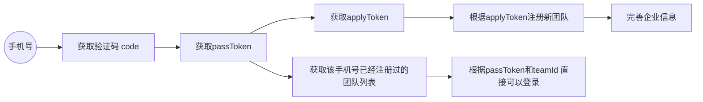
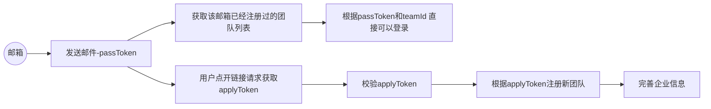
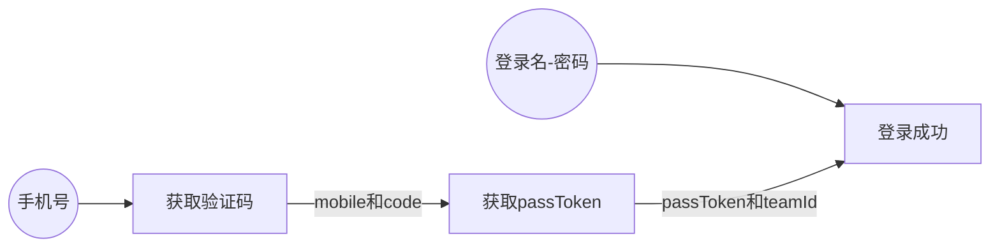
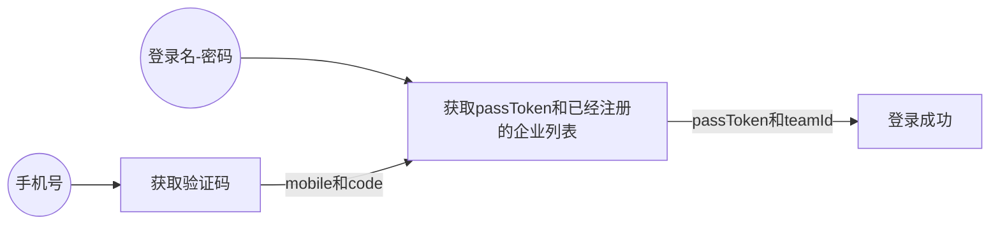

# 注册分为手机号注册和邮箱注册

## 1. 手机号注册流程如下:

```mermaid
graph LR;
    mobile((手机号)) -->getCode[获取验证码 code];

    getCode -->getPassToken[获取passToken];

    getPassToken --> getApplyToken[获取applyToken];


    getPassToken  --> getTeams[获取该手机号已经注册过的团队列表];

    getApplyToken-->signup[根据applyToken注册新团队]

    signup--> makeup[完善企业信息]

    getTeams --> signin[根据passToken和teamId 直接可以登录]
```

## 2. 邮箱注册流程如下:

```mermaid
graph LR;
    email((邮箱)) -->sendEmail[发送邮件-passToken];

    sendEmail -->getApplyToken[用户点开链接请求获取applyToken];

    sendEmail  --> getTeams[获取该邮箱已经注册过的团队列表];

    getTeams --> signin[根据passToken和teamId 直接可以登录]

    getApplyToken --> checkApplyToken[校验applyToken];

    checkApplyToken --> signup[根据applyToken注册新团队]

    signup--> makeup[完善企业信息]

```

# 登录分为企业内登录和外部登录

## 1. 企业内登录流程如下：

```mermaid
graph LR;
    namePassword((登录名-密码)) -->signin[登录成功];

    mobile((手机号)) -->code[获取验证码];

    code-- mobile和code --> passToken[获取passToken];

    passToken -- passToken和teamId --> signin

```

## 2. 外部登录流程如下：

```mermaid
graph LR;
    namePassword((登录名-密码)) -->passToken[获取passToken和已经注册的企业列表];

    passToken--passToken和teamId-->signin[登录成功]

    mobile((手机号)) -->code[获取验证码];

    code-- mobile和code --> passToken

```